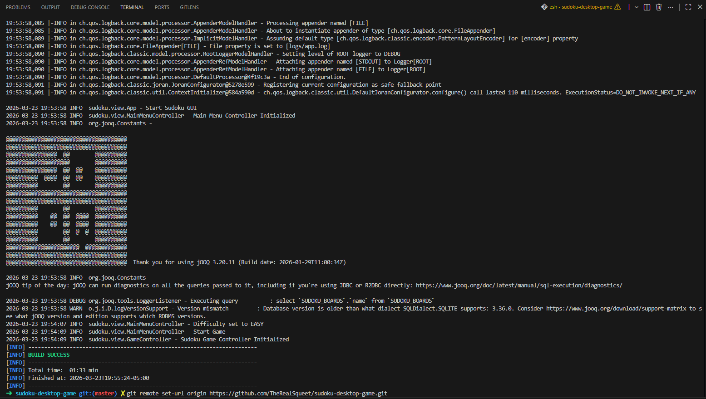
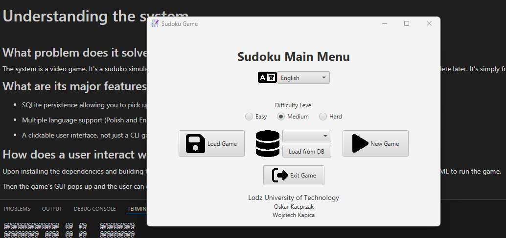
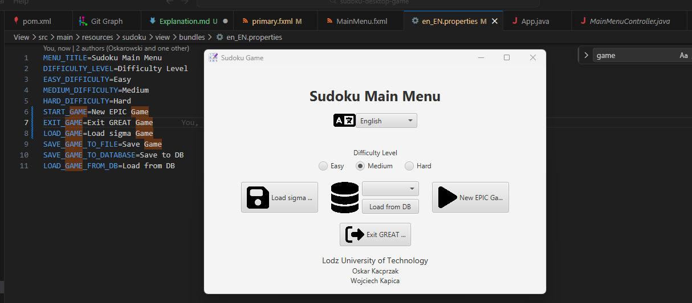

## Getting the System Running

#### Environment:

-   openjdk version "21.0.10" 2026-01-20 LTS
-   IDE: VsCode
-   OS: Windows

#### Steps to get the system running:

First I needed to install maven as the package manager, realized I didn't have JDK so installed that as well.

Next had to update the versions of jooq in the dependency files and remove one breaking dep.

After fixing the deps the system runs.

#### Any build errors encountered:

Maven initial installation and build didn't want to run as there was a version mismatch issue. 

I realigned the versions and removed a breaking dep as previously stated which fixed the build issues.

breaking dep was: `jooq-codegen-maven`

#### How I diagnosed and resolved the issues:

The stacktrace gave a fairly straightforward explanation in the console when the errors ran.

I was able to paste the errors directly into chatGPT and ask it to direct me to the deps to fix to avoid digging through the log.

Three attempts later and manually implementing the change myself to avoid chatGPT's complimentary restructures and the issue was resolved.

#### My overall approach:

Attempt to install and build to see which errors would appear, then paste the errors into AI for a quick summary and implement recommended changes.

#### Evidence:

successful build photo:

 

successful running of the application photo:

 

## Understanding the System

#### What problem does it solve?

The system is a video game. It's a suduko simulator with local persistence enabled by SQLite so you can continue matches that are partway complete later. It's simply for entertainment.

#### What are its major features?

-   SQLite persistence allowing you to pick up where you leave off
-   Multiple language support (Polish and English)
-   A clickable user interface with a simple GUI

#### How does a user interact with it?

Upon installing the dependencies and building the project the user runs `mvn javafx:run -pl View` in their CLI as per the original application README to run the game.

Then the game's GUI pops up and the user can click through it to start/load a game and play, save, etc.

#### Evidence

I changed the UI elements on the main menu to include some silly words I find funny like "sigma" and "EPIC" by editing the english language properties files in the view/bundles folder.

Here's what it looks like now.

 

## Architecture Exploration and Reflection

#### What is the Architectural Style?

I see MVC here because:

At the root level I see folders for Model, View, and Dao/JdbcDao. This follows the model view controller structure as the

-   view folder contains front end elements such as fxml, xml, and frontend serving java. 
-   model folder contains the main and test sub folders with core logic like exceptions, helpers, etc.
-   dao folder contains db relevant information such as interfaces defining reads and writes for persistence

The author also states in the README that the project is MVC, which it definitely is.

#### How are responsibilities divided across packages?

As stated above the view package handles front end manipulation, display, and user entry. The model package handles core processing and business logic, which in this case is game logic such as the solvers. The dao package handles persistence.

#### Is there separation between UI and Logic?

Yes on multiple levels. There's separation on a file based level as there are fxml files for handling display (such as the `MainMenu.fxml`) and there are java files for handling logic (such as the `MainMenuController.java`).

There is also a separation that UI serving files are held in the view package, and core business logic serving files are held in the model package.

#### Where is coupling high?

There is high coupling between the `BacktrackingSudokuSolver.java` class and the `SudokuBoard.java` class. The sudoku board is a concrete defined type which the backtracking solver algorithm receives in order to solve the board. If there were to be an abstract interface of a board type that the sudoku board would implement, and the backtracking algorithm would receive to solve, then this could be easily swapped for a new board type in the future.

As of right now the backtracking algorithm relies heavily on the concrete sudoku board class type, so it's highly coupled.

#### Where is cohesion strong?

The `BacktrackingSudokuSolver.java` also happens to be an extremely cohesive class. It only contains functions which it needs to perform its responsibilities and nothing more. It also doesn't rely arbitrarily on outside classes which would be feature envy if they were to take care of its duties (like if the generating random numbers fit within a separate class and was called). It contains what it needs and nothing more, highly cohesive.

#### Does this architecture make maintenance easier or harder?

This architecture makes maintenance easier as it's clearly separated and labeled. I was able to enter the application without any prior knowledge and easily find the front end files in order to edit the text of a UI element for the previous task with ease. I've never worked with this java MCV maven jooq type combo in my life but still finding the en_EN.properties file was fairly straightforward. 

I found in the `MainMenu.fxml` file it loaded a string with the % operator named `%START*GAME*` and I followed the property with that name in the search bar back to the `en_EN.properties` file which was easily accessible in the view folder as it should be as it serves front end facing information as per the MCV architecture. Unfamiliar to me it is still easy to maintain.

## Testing and Build State

#### Are there tests in the repository?

Yes there are tests in the repository 

#### Are the tests runnable and where do they live?

The three main areas the tests live are to support:

-   strategies
-   dao/jdbcDao
-   models
-   views

The tests are not runnable directly out of the gate, upon running `mvn test` I encounter build errors:

[INFO] SudokuGameProject .................................. SUCCESS [  0.003 s]  
[INFO] ModelProject ....................................... SUCCESS [  4.152 s]  
[INFO] DaoProject ......................................... SUCCESS [  1.244 s]  
[INFO] JdbcDaoProject ..................................... FAILURE [  5.565 s]  
[INFO] ViewProject ........................................ SKIPPED

the JdbcDao project fails and crashes the suite, this needs to be fixed for the suite to run

#### They weren't, what does this suggest about maintainability and risk?

The application needs to have its testing suite fixed in order to add new tests and run them with accurate output. Without being able to do this the application is at a high risk for bugs making their way into the production code.

This application will not be able to be properly maintained without correcting the test error.

#### What test I implemented and why:

note: I fixed the JdbcDaoProject test failure by updating the `jooq-codegen-maven` dependency version to 3.20.11. The test suite now runs cleanly

In the `SudokuBoardTest.java` I added the test:

@Test

    void testSetFieldAllowsInvalidStateButDetectsIt() throws FillingBoardSudokuException {

        SudokuBoard board = new SudokuBoard(new BacktrackingSudokuSolver());

        board.solveGame();

        int duplicateValue = board.getField(1, 0).getValue();

        board.setField(0, 0, duplicateValue);

        // now the board should be invalid

        assertFalse(board.isValidSudoku());

    }

this test shows that the sudoku board they have allows you to input invalid numbers (which would be numbers you can't place into a cell based on the rules of sudoku),

and when there's an invalid state combo of numbers the board.isValidSudoku() check should return false. It passes and asserts that the board is in fact false.

#### What type of test is this?

It's a unit test as I'm only testing the output of a single function in the application. Yes we're using board manipulating calls like creating a board, getting/setting fields within it, then finally checking if it's valid.

But there are no links between this logic and any persistence layer interaction. This is the minimal amount of only memory interacting calls we could use to test if the board.isValidSudoku() works properly

#### Was refactoring required to enable testability?

No true refactoring was required. I had to update the version of `jooq-codegen-maven` as previously mentioned but that was a simple one line fix, I wouldn't consider that a refactor.

#### Where does my new test exist in the project structure?

ModelsrctestjavamodelsSudokuBoardTest.java

## Identifying a Maintenance Opportunity

#### Potential new Feature

Giving the player a hint if they're stuck. This would be a button that you could potentially press a limited amount of times within a match and it would fill in value for the player.

It could be the most constrained variable and select the least constrained value, or if somehow the machine knew the correct answer in advance it could just fill in the correct answer.

Either approach provides different technical changes, but the outcome is the same. It's a hint when you're stuck

#### Classes and Modules that would be affected

For the most constrained variable placing the least constrained value (machine learning sudoku board solving approach) we would need a new class file to host the algorithm, ex `SudokuHintAlgorithm.java` along with a test class for it.

We would also need a UI element which would be the hint button that the user could click to run the algorithm. So `SudokuGame.fxml` would be affected.

the `SudokuBoard.java` file would call the algorithm in usage.

The `GameController.java` file would also need to be aware of the button and call the right method in the `SudokuBoard.java` which would use the algorithm to enter in the hinted value in the hinted location.

#### Architectural Risk

If we were to make this change the primary risks would be bugs within the new algorithm class itself, so we would firstly need to add a `SudokuHintAlgorithmTest.java` file to contain unit tests for this class.

Secondly we would need integration tests to ensure the interaction between the hint algorithm and the sudoku board works as intended. This way we would avoid bugs in the seam between the two.

This would be a fairly modular addition so not much would need to change around it, other than the addition of a front end component in the to `SudokuGame.fxml` host the button

#### If I would introduce a Seam for this change

This would not require a seam as it's a standalone function that's called upon by the help button and processed by the board.

Potentially into the future you could have an assortment of help buttons that have difference functions and abstract the generalized parts into a help button interface, but not necessary here.

## Overall Maintainability Assessment

#### Does the system appear actively maintained?

No the system is definitely not actively maintained. There were a series of pushes from inception to last recent in the span of March 26, 2024 - June 23, 2024. It's March 24, 2026 now so it's safe

to assume that no one is actively maintaining the project.

#### Is technical debt visible? What Evidence is there?

The heavy reliance on third party packages to do mission critical tasks like persistence make it so that the application depdencies must remain

updated constantly in order the the app to be maintainable by new developers with modern development environments. This is unavoidable in this context though as SQLite persistence needs communcation

wrappers (JOOQ here) to be implemented. Dependency version drift is common technical debt in legacy systems.

Even though I had to make edits just to get the application working properly, there's nothing they could've done differently.

There are a couple of code smells, like the tight coupling between the `BacktrackingSudokuSolver.java` class and the `SudokuBoard.java` class.

Interfaces are used throughout the application like the `Verifiable.java` but it would be nice if there was an I at the start of its name to make it more identifiable,

and I'm not sure why the `SudokuBaseContainer.java` file is in the interfaces folder alongside it while it's clearly a class and not an interface.

#### Are SOLID Principles Respected or Violated?

There are cases of clear SOLID violations which we can go through a few:

Single Responsibility Violation:

The `GameController.java` file takes care of both controlling the state of the game, through endGame(), initialize(URL location, ResourceBundle resources), and initSudokuBoardGridPane().

But it also has the createTextField(SudokuField sudokuField, double textFieldPixelSize) function inside of it, for converting the sudokuField into a text field for proper display. This should sit

within a different class as it's not relevant to managing the state of the game, but instead it's a helper for setting up display relevant object types.

Open-Closed Violation:

In the `DifficultyEnum.java` class the clearSudokuFieldsFromSudokuBoardBasedOnDifficulty(SudokuBoard sudokuBoard) function violates the open and closed principle with its long chain

of a switch case to handle the logic of which number of spaces to clear based on the difficulty selected for the board.

Instead we should have the difficutly levels represent the actual number of spaces which they are to clear instead of these "1,2,3" tags, and then the clear function could simply loop up to the value

contained within the object. That way no switch statement is required, and the amount of spaces that will be cleared is designated in the constructor. Adding a new difficulty then wouldn't require

changing any code in the clear function!

Liskov Substituion Principle Violation:

All subclasses of classes I could find don't implement the superclasses functions in a way that would break functionality if you were to swap the subclass in for the superclass.

The Save strategy classes are good examples of well done interface implementation. They both implement `SaveSudokuBoardStrategy` properly.

Interface Segragation Violation:

I could not find any classes which were forced to implement methods they don't actually have.

Dependency Inversion Violation:

There is a dependency inversion violation happening within the between the `SudokuBoard.java` class as it relies on a concretion of the `BacktrackingSudokuSolver.java` class

in order to perform the backtracking solving algorithm. Instead there should be a defined interface of an abstract type that the backtracking solver implements which the sudoku board should rely on.

That way if the solver were to ever be swapped in the future you would not need to edit the programming of the sudoku board. You would simply pass in the new solver.

#### How Difficult would it be to Extend this System Long Term?

It wouldn't be too difficult to maintain as the author has designed the system in a valid MCV pattern as well as uses interfaces, strategies, custom exceptions, a well made README, and a fair coverage of tests.

(Could use integration testing but the application is still currently small). The packages need to be consistently updated to stay current with modern versions of the dependencies as time goes by,

but that's also fairly straightforward.

Extending the feature set might be a bit more tricky as there is a fair bit of coupling between the classes that already do exist, such as the `BacktrackingSudokuSolver.java` and the `SudokuBoard.java` example previously mentioned.

Because of this adding new features would likely require abstracting some of the concretions that do exist and establishing clear generic patterns that new features could fall into alongside pre-existing features.

This would be fairly straightforward though thanks to the clearly defined MCV architecture, so extending would still be fairly reasonable long term.

#### Should we Incrementally Improve or Major Refactor?

I believe we should incrementally improve rather than perform a major refactor. The application has a valid architecture, a clear definition between the logic, UI, and persistence handling, and the

foundation for custom exceptions and tests. The biggest issues I ran into cannot be avoided with a refactor (we will still have dependencies for SQLite persistence that need updating regardless of design patterns)

and there were little in terms of other pressing issues.

I would establish a solid naming convention across files to help differentiate between classes and interfaces, but it seems a naming convention is already being used for exceptions, strategies, and tests.

So this is a minor addition to what's already being done.

Refactors cost quite a bit of time, money, and missed opportunity spent refining the system that's already there. This isn't bad enough to warrant a refactor.